<p align="right">
  <a href="./README.md">🇺🇸 English Version</a>
</p>

<h1 align="center">IntraNet</h1>
<p align="center"><em>Uma plataforma corporativa profissional para gerenciamento de operações logísticas em larga escala.</em></p>

<p align="center">
  
  
  
  
</p>

<p align="center">
  
  
  
  
  
  
  
</p>

---

## 📌 Visão Geral

**IntraNet** é uma plataforma corporativa profissional projetada para gerenciamento de operações em larga escala, centralizando fluxos de trabalho integrados para:

- 🎫 **Sistema de Chamados** — Gerenciamento completo de tickets com fluxos Kanban visuais e rastreamento de SLA por prioridade.
- 💻 **Monitoramento de Ativos de TI** — Monitoramento em tempo real de hardware e dispositivos com telemetria via agentes WebSocket.
- 👥 **Gestão de Usuários e Departamentos** — Gerenciamento centralizado de colaboradores, permissões e hierarquia de setores.
- 📦 **Controle de Estoque** — Rastreamento em tempo real de materiais, equipamentos e recursos.
- 📊 **Analytics Executivo** — Dashboards de desempenho e métricas operacionais (MTTR, SLA, Tendências de Volume).
- 🔔 **Notificações Integradas** — Notificações push nativas e webhooks externos para alertas entre sistemas.
- 💬 **Chat Interno** — Mensagens em tempo real integradas diretamente ao fluxo de chamados.

### 🎯 Objetivo Principal

Servir como um **hub unificado** para comunicação e gerenciamento operacional, consolidando múltiplos fluxos de trabalho em uma interface intuitiva e responsiva — eliminando a necessidade de diversas ferramentas desconectadas.

---

## 📱 Suporte Mobile & PWA

A plataforma foi construída com mentalidade **mobile-first** e é totalmente instalável como Progressive Web App:

| Recurso | Detalhes |
|---|---|
| **PWA Instalável** | Funciona como app nativo no Android e iOS via prompt do navegador |
| **Suporte Offline** | Service Worker com estratégia network-first + fallback por cache |
| **Gestos Touch** | Swipe da borda esquerda para abrir/fechar sidebar |
| **Safe Area iOS** | Suporte a notch e Dynamic Island via `env(safe-area-inset-*)` |
| **Layout Responsivo** | Sidebar adaptativa (drawer no mobile, fixa no desktop) |
| **Kanban por Swipe** | Navegação entre colunas via swipe com scroll-snap |
| **Toasts Mobile** | Notificações com swipe-to-dismiss via Sonner |
| **Cards Adaptativos** | Lista de tickets em cards no mobile vs tabela no desktop |

> O sistema roda perfeitamente em **Android, iOS (iPhone/iPad) e todas as telas de 320px a 1920px+**.

---

## 🖼️ Preview Visual

A plataforma possui uma interface moderna com suporte completo ao **modo claro/escuro** e **responsividade mobile**.

### 🖥️ Desktop

<p align="center">
  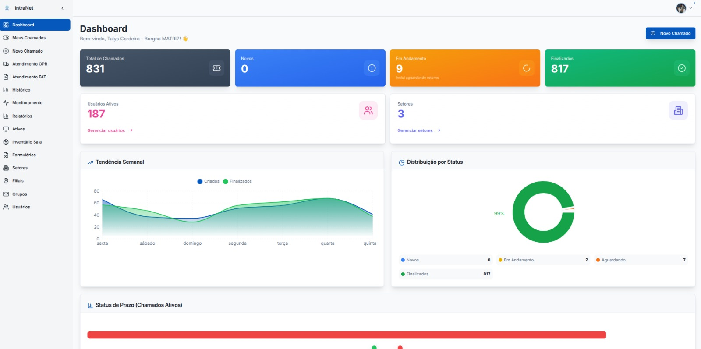
  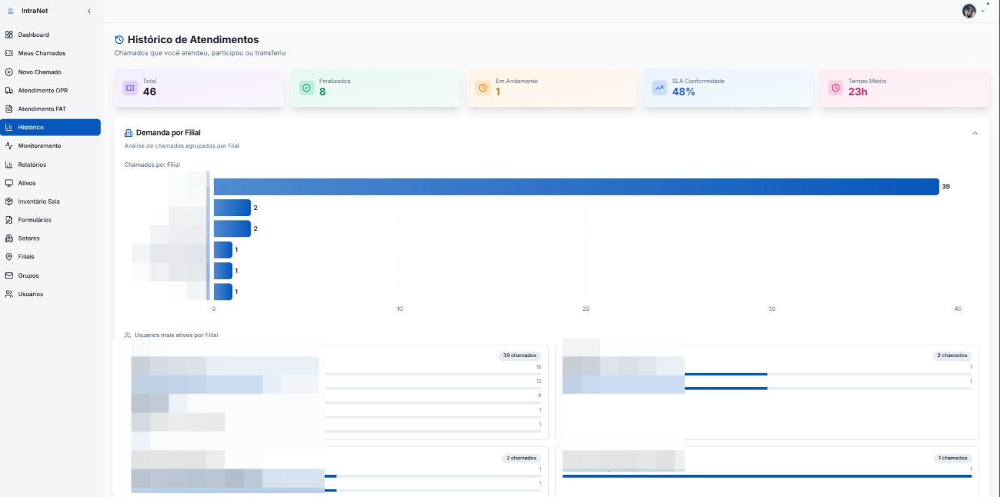
</p>
<p align="center">
  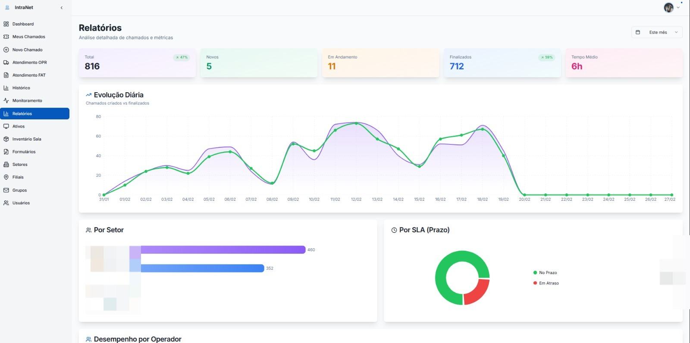
  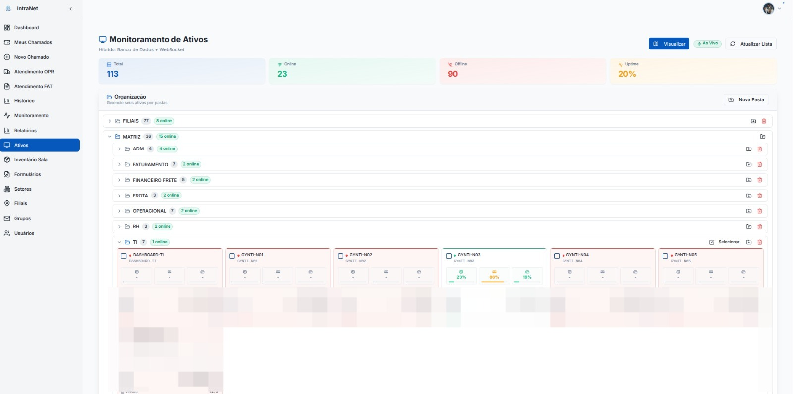
</p>
<p align="center">
  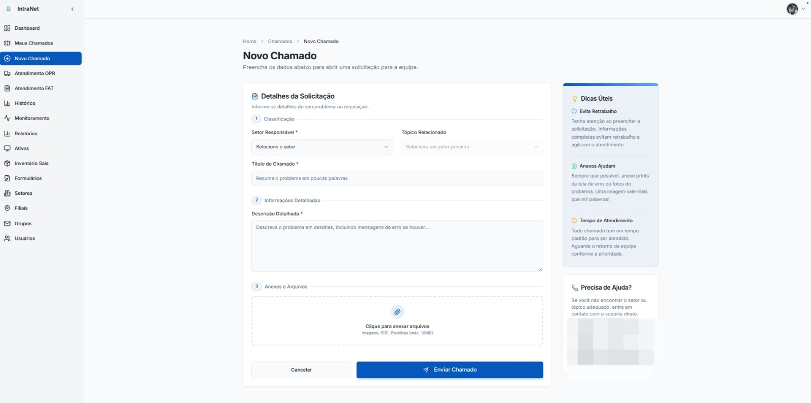
  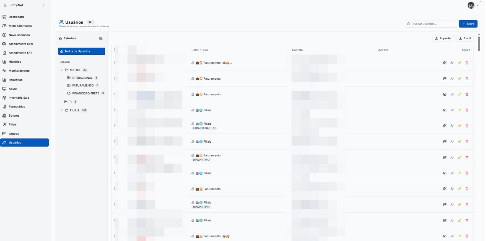
</p>
<p align="center">
  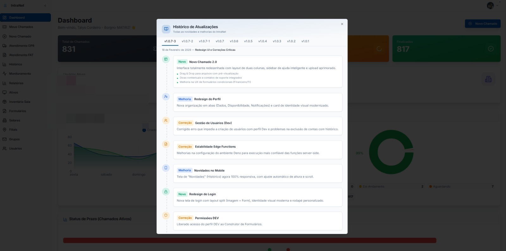
  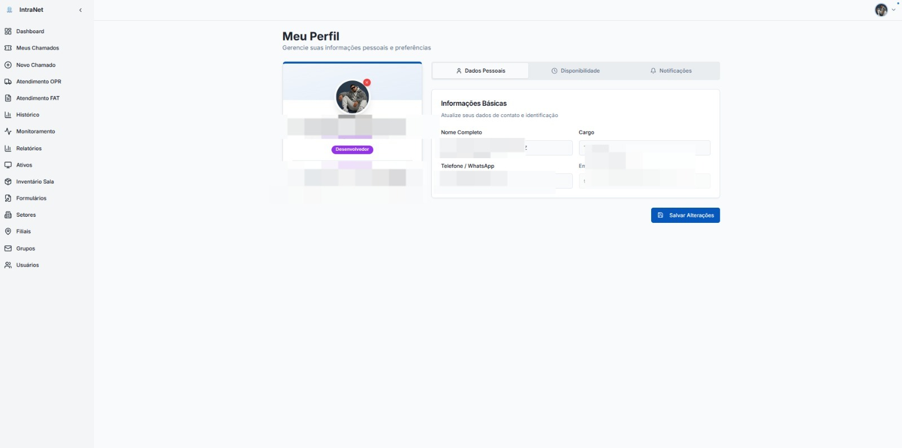
</p>
<p align="center">
  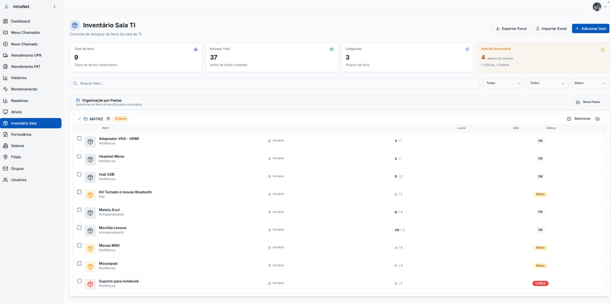
</p>

### 📱 Mobile (iPhone — PWA)

> Todas as telas capturadas rodando como PWA instalado no iPhone, demonstrando o modo escuro, layouts responsivos e navegação otimizada para toque.

<p align="center">
  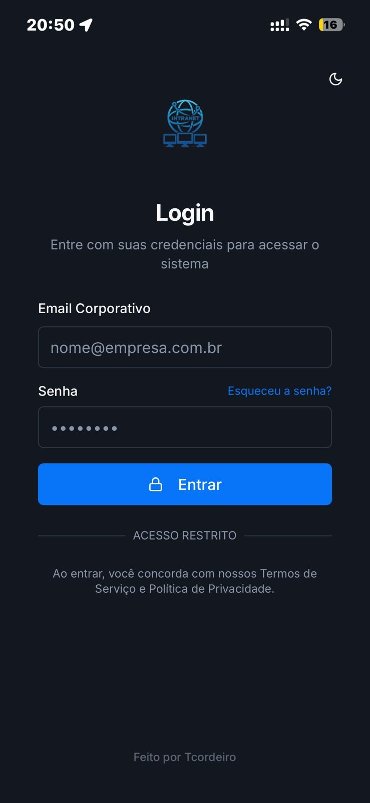
  
  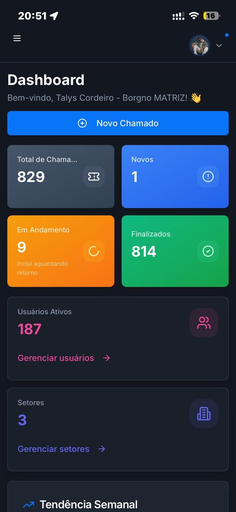
</p>
<p align="center">
  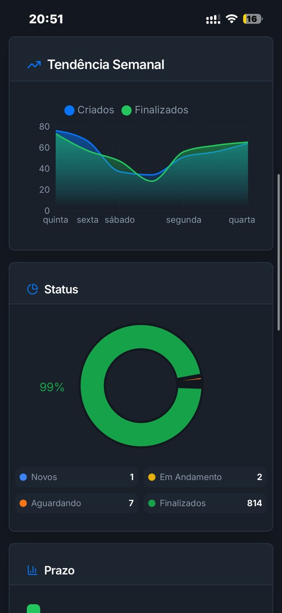
  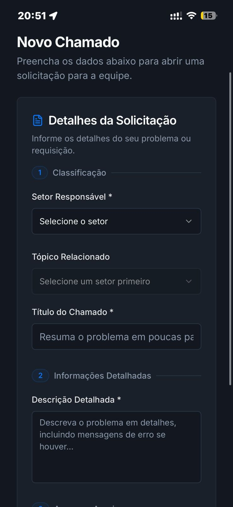
  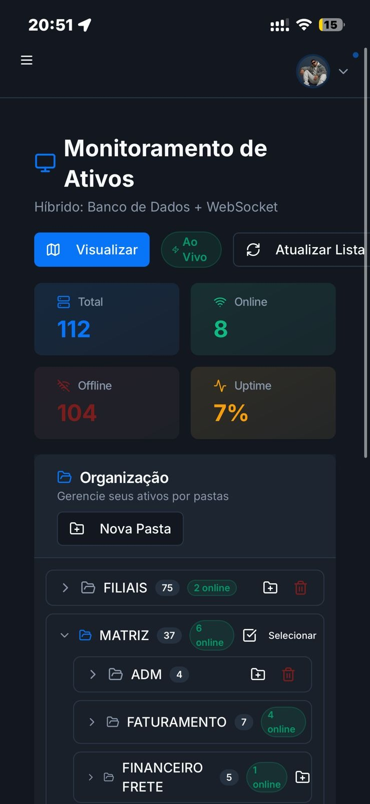
</p>

---

## 🏗️ Arquitetura do Sistema

A plataforma segue uma abordagem moderna **serverless-first** combinada com capacidades em tempo real:

```
┌─────────────────────────────────────────────────────┐
│                  React 18 + TypeScript               │
│         (Vite + Tailwind + shadcn/ui + PWA)          │
└────────────────────────┬────────────────────────────┘
                         │
           ┌─────────────┼─────────────┐
           │             │             │
    ┌──────▼──────┐ ┌────▼────┐ ┌─────▼──────┐
    │   API REST  │ │Realtime │ │  WebSocket  │
    │  (PostgREST)│ │(LISTEN/ │ │  (Telemetria│
    └──────┬──────┘ │NOTIFY)  │ └─────┬──────┘
           │        └────┬────┘       │
    ┌──────▼──────────────▼───────────▼──────┐
    │         Supabase (PostgreSQL + Auth)    │
    │              + Edge Functions           │
    └────────────────────────────────────────┘
```

| Camada | Tecnologia |
|---|---|
| Frontend | React 18, TypeScript, Vite |
| Estilização | Tailwind CSS, shadcn/ui, Material-UI |
| Estado | React Query (TanStack) |
| Backend (BaaS) | Supabase (PostgreSQL, Auth, Storage, Realtime) |
| Computação | Edge Functions (Deno Runtime) |
| Telemetria | WebSocket Server customizado em Node.js |
| Gráficos | Recharts |
| Drag-and-Drop | @hello-pangea/dnd |
| Mobile / PWA | Service Worker, Web App Manifest |

---

## 💻 Stack Técnico

### Frontend
- **React 18 & TypeScript:** Desenvolvimento de UI robusto e tipado.
- **React Query:** Gerenciamento avançado de estado server-side com cache, refetching em background e atualizações otimistas.
- **Tailwind CSS & shadcn/ui:** Biblioteca de componentes consistente, acessível e de alta performance.
- **Recharts:** Visualização de dados complexos para dashboards operacionais e KPIs.
- **@hello-pangea/dnd:** Experiência fluida de arrastar e soltar para o quadro Kanban.
- **Sonner:** Notificações toast com swipe-to-dismiss nativo no mobile.

### Backend & Infraestrutura
- **Supabase Cloud:** Banco de dados, autenticação, storage e engine de tempo real integrados.
- **PostgreSQL RLS:** Row-Level Security impondo isolamento de dados multi-tenant no nível do banco.
- **Engine em Tempo Real:** Supabase Realtime com subscriptions com debounce para atualizações instantâneas da UI.
- **Edge Computing:** Funções serverless em Deno para lógica de negócio crítica (notificações, geocodificação, resolução segura de perfis).
- **WebSocket Server:** Agente Node.js customizado para dados de telemetria de hardware em alta frequência.
- **Service Worker:** Implementação manual com estratégia network-first + fallback por cache para suporte offline.

---

## 🔐 Segurança

| Recurso | Implementação |
|---|---|
| **RBAC** | Permissões granulares para Admin, Operador, Dev e Usuário |
| **Autenticação JWT** | Sessões seguras gerenciadas pelo Supabase Auth |
| **Row-Level Security** | Políticas aplicadas diretamente no nível do PostgreSQL |
| **Criptografia de Dados** | Tratamento seguro de telemetria e dados sensíveis |
| **Validação de Entrada** | Validação de schemas Zod em todos os formulários |
| **Modo Somente Visualização** | Chat e drag-and-drop bloqueados para usuários em modo leitura do Kanban |

---

## 📋 Módulos Principais

| Módulo | Descrição | Status |
|---|---|---|
| 🎫 Chamados / Kanban | Gerenciamento completo do ciclo de vida com SLA | ✅ Produção |
| 💻 Telemetria de Ativos | Monitoramento de hardware em tempo real via WebSocket | ✅ Produção |
| 👥 Gestão de Usuários | RBAC + hierarquia departamental | ✅ Produção |
| 📊 Dashboard Analytics | KPIs, MTTR, conformidade com SLA | ✅ Produção |
| 🔔 Notificações | Push + integração com Webhook | ✅ Produção |
| 💬 Chat Interno | Mensagens em tempo real por chamado | ✅ Produção |
| 📦 Estoque | Rastreamento de materiais + exportação Excel | ✅ Produção |
| 📱 PWA | App instalável com suporte offline | ✅ Produção |

---

## 🖼️ Nota de Portfólio

> **Nota:** Este repositório é um **showcase** de design arquitetural e proficiência técnica. O código-fonte da lógica de negócio principal, algoritmos proprietários e implementações de servidor privado estão em um **repositório privado** para proteger a propriedade intelectual.

**O que está incluído aqui:**
- ✅ Documentação técnica detalhada
- ✅ Diagramas de arquitetura do sistema
- ✅ Especificações do stack tecnológico
- ✅ Previews visuais e screenshots
- ✅ Arquivos de configuração demonstrando expertise em setup de ambiente

**O que está no repositório privado:**
- 🔒 Código-fonte completo da aplicação
- 🔒 Implementações das Edge Functions
- 🔒 Scripts de migração do banco de dados
- 🔒 Implementação do servidor WebSocket

---

## 📞 Contato

> Interessado na implementação completa ou tem alguma dúvida?

**Talys Matheus Cordeiro Silva (Tcordeiro)**  
Sinta-se à vontade para entrar em contato pelo [GitHub](https://github.com/Tcordeir0) ou conectar-se no [LinkedIn](https://www.linkedin.com/in/thalescordeiro/).

---

## 📜 Licença

Copyright © 2026 Talys Matheus Cordeiro Silva — Todos os direitos reservados.  
Este projeto é para **fins de demonstração apenas**. Cópia, modificação, distribuição ou uso não autorizados deste projeto, em parte ou no todo, são estritamente proibidos.

Veja [LICENSE](./LICENSE) para mais detalhes.
